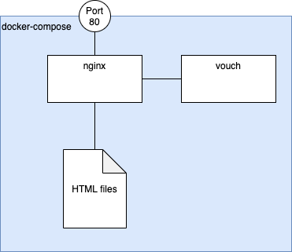

# nginx_with_logins

A demo setup for having restricted access to web-sites or specific paths within a website based on nginx. `docker-composed` based and deployed via Ansible.

## Overall setup

## Google settings

## Reading

* A good and thorough explanation of how nginx and Letsencrypt interact within a docker setup: [How to set up an easy and secure reverse proxy with Docker, Nginx & Letsencrypt](https://medium.com/free-code-camp/docker-nginx-letsencrypt-easy-secure-reverse-proxy-40165ba3aee2)
* May be I want to use [Statping](https://github.com/statping/statping)
* A complete guide: [Add Google Authentication to any Website using Nginx and Oauth Proxy](https://dev.to/ahmedmusaad/add-google-authentication-to-any-website-using-nginx-and-oauth-proxy-259l)
* [Validating OAuth 2.0 Access Tokens with NGINX and NGINX Plus](https://www.nginx.com/blog/validating-oauth-2-0-access-tokens-nginx/#production-configuration)
* Another alternative to OAuth2 Proxy that I don't plan to use (mainly because the guides I found use OAuth Proxy): [Vouch](https://github.com/vouch/vouch-proxy)
* Two explanations on how to use Vouch: [Use nginx to Add Authentication to Any Application](https://developer.okta.com/blog/2018/08/28/nginx-auth-request) and [Enforce Google Authentication for Any Application with nginx and Vouch Proxy](https://medium.com/lasso/use-nginx-and-lasso-to-add-google-authentication-to-any-application-d3a8a7f073dd)
* The docker image I plan to use is from [Bitnami](https://hub.docker.com/r/bitnami/oauth2-proxy/)
